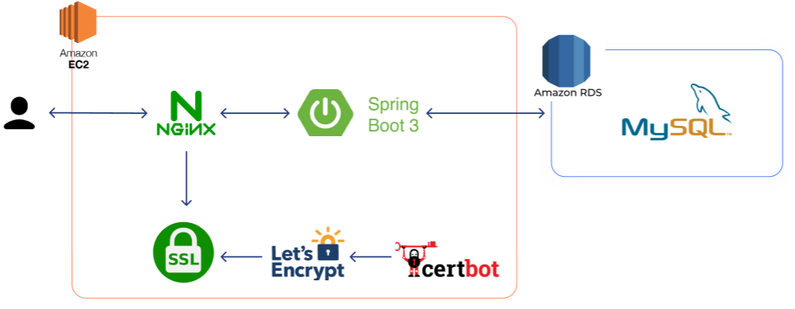
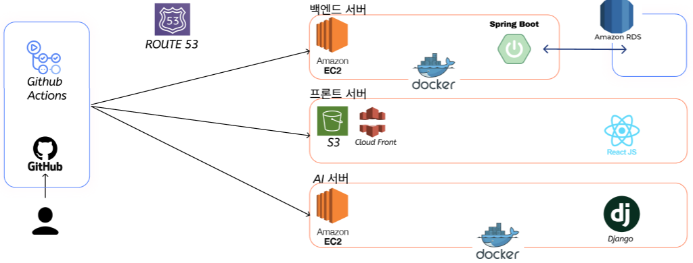
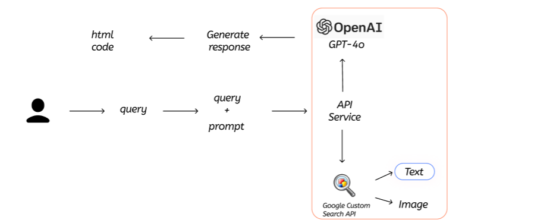

<h1>  ChatPPT</h1>
<h3>LLM을 활용한 PPT 제작 사이트</h3>
 

- 🔥**카카오테크 부트캠프 해커톤**🔥
- **주제**: LLM을 활용한 AI 기반 서비스 개발 프로젝트
- **개발기간**: 2024년 9월 5일 ~ 9월 7일 

## 🔗[ChatPPT  ](https://chatppt.site/)

<br>

## 👋 About Project 
`ChatPPT` 는 AI 기반의 대화형 인터페이스를 통해 사용자가 원하는 주제, 스타일, 슬라이드 구성 등을 간단한 대화로 요청하면 AI가 자동으로 PPT를 생성하는 서비스 입니다.

## ⭐Service and Function
복잡한 도구 사용    ➡️  간단한 대화만으로 PPT 제작!

비대화형 플랫폼     ➡️  대화형 플랫폼

시간 소모적인 작업  ➡️  시간 절약


## 🛠️Structure
### | FrontEnd


### | BackEnd

 
 
 

 
**💻Architecture** 
<br>

### | Cloud


 <br>

**☁️Architecture** 
<br>

### | AI


**🤖Architecture** 
<br>


### | Directory Structure
```
frontend│
├── README.md         
├── frontend.iml
├── package-lock.json        
│
├── frontend/           
│   ├── public/
|   |  ├── index.html   
│   |  ├── manifext.json
|   |  ├── robots.txt          
│   └── ...
│   ├── src/
|   |  ├── api/   
│   |  ├── components/
|   |  ├── app.jx         
│   |  ├── index.css
│   └── ... 
│   ├── webpack.config.js
│   ├── package.json
│   ├── postcss.config.js
│   └── ...
|

```
```
backend
├── README.md         
├── Dockerfile
├── gradlew        
│── settingsl.gradle
|── ... 
|
├── gradle/wrraper
|   |── gradle-wrapper.jar   
│   ├── gradle-wrapper.properties
|
├── src/
|   |  ├── main/   
|   |    |── java/team/flight/backend/
|   |    |   |── config/  
|   |    |   |── controller/  
|   |    |   |── dto/ 
|   |    |   |── entity
|   |    |   |── '''   
|   |    |── resources/
|   |    |   |── application.yml
|   |  ├── test/java/team/flight/backend
|   |    |── BackendApplicationTests.java
|
```


```
flight-ai|
├── README.md         
├── db.sqlite3
├── manage.py       
│── requirements.txt
|
├── chatai/           
│   ├── migrations/
│   ├── admin.py
│   ├── apps.py
│   ├── models.py
│   ├── test.py
│   ├── views.py
│   ├── ...
├── flgihtgpt/           
│   ├── asgi.py
│   ├── settings.py
│   ├── urls.py
│   ├── wsgi.py
├── templates/           
│   ├── base.html
│   ├── chatbot.html
| ...

```

### 👤Members
|      윤찬호       |          임수민         |     신유승         |      양세민       |      김예지       |      이혜민       |                                                                                                               
| :------------------------------------------------------------------------------: | :---------------------------------------------------------------------------------------------------------------------------------------------------: | :---------------------------------------------------------------------------------------------------------------------------------------------------------------------------------------------------: | :------------------------------------------------------------------------------: | :------------------------------------------------------------------------------: | :------------------------------------------------------------------------------: |  
|       |                          |                      |       |       |       |
|   `풀스택`   |    `풀스택`  | `풀스택`  | `인공지능`  |   `인공지능`   |   `클라우드`   |
|   [@yooooonshine](https://github.com/yooooonshine)   |    [@extinctmule](https://github.com/extinctmule)  | [@Youthhing-03](https://github.com/Youthhing)  | [@sminy85](https://github.com/sminy85)  |   [@jyhannakim](https://github.com/jyhannakim)   |   [@2ming00](https://github.com/2ming00)
